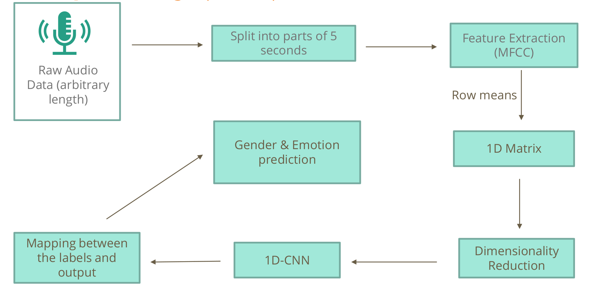

# SERvis : AI Healtchare Services

## Emotional Health Detection using Speech for Effective & Efficient Diagnosis 

### About
**SERvis** is a speech-based emotion recognition system conceptualized by a team of 5 stduents from IIT Bombay for fulfilling the requirements of the course **ME781 : Statistical Machine Learning and Data Science**, Autumn 2021 . 

### Objective
Access to records of emotional indicators of patients can improve diagnosis and treatment strategies. SERvis aims to develop a system that would accomplish this
by analyzing user’s speech with Deep Learning.

### Conceptual Design

#### Audio Pre-processing
Mel-Frequency Cepstral Coefficients (MFCC) based feature extraction is used to extract data from audio files. It can be used to distiguish between emotions and genders. A 2-D matrix of Features is extracted from audio clips and converted into 1-D by taking row and column means.

#### Modelling
Post feature extraction a 1-D CNN is applied on the dataframe obtained. Model is evaluated using a simple 3:1 Train:Test split of data.

#### Overview

### Datasetsets
1. **TESS (Toronto Emotional Speech Set)**  
   - 2 female speakers (young and old)
   - 2800 audio files
   - random words spoken in 7 different emotions

2. **SAVEE (Surrey Audio-Visual Expressed Emotion)**
   - 4 male speakers
   - 480 audio files
   - same sentences spoken in 7 different emotions

3. **RAVDESS**
   - 2452 audio files
   - 12 male speakers and 12 Female speakers
   - the lexical features (vocabulary) of the utterances are kept constant by speaking only 2 statements of equal lengths in 8 different emotions by all speakers

4. **CREMA-D (Crowd-Sourced Emotional Multimodal Actors Dataset)**
   - 7442 audio files
   - 91 different speakers (48 male and 43 female between the ages of 20 and 74) of different races and ethnicities
   - different statements are spoken in 6 different emotions and 4 emotional levels (low, mid, high and unspecified)
   
### References
1. 
### Contributors
* Gerard Tony Thomas
* Navjit Debnath
* Pushpendra Yadav
* Shashwat Trivedi
* Shiven Barbare

